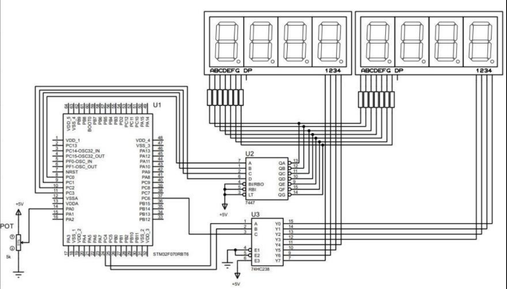

# stm32-programmable-digital-clock
STM32-based programmable digital clock using external interrupts, ADC, RTC and multiplexed 7-segment displays.
The project was designed to display hours, minutes, and seconds while allowing the user to configure the time through an interrupt-driven interface and an analog potentiometer.

## Project Overview

The objective of this project was to design and implement a programmable digital clock using embedded C and an STM32 microcontroller.

The system uses two 4-digit common-anode 7-segment displays to represent time in an HH:MM:SS format.

A potentiometer connected to the ADC allows the user to modify the time, while an external interrupt is used to select whether the ADC value modifies:

- Seconds
- Minutes
- Hours

The selected value is then stored in the STM32 Real-Time Clock (RTC).

## Features

- Real-time clock implementation using STM32 RTC
- External interrupt-based user control
- Analog-to-Digital Converter (ADC) input
- ADC value scaling for time configuration
- 8-digit 7-segment display
- Display multiplexing
- GPIO control
- Embedded C firmware
- Hardware prototype implementation

## System Architecture

```text
                   Potentiometer
                        │
                        ▼
                       ADC
                        │
                        ▼
Push Button ──► External Interrupt
                        │
                        ▼
                 ┌─────────────┐
                 │    STM32    │
                 │             │
                 │     RTC     │
                 │     ADC     │
                 │    GPIO     │
                 └──────┬──────┘
                        │
              ┌─────────┴─────────┐
              │                   │
              ▼                   ▼
          BCD Decoder        Digit Decoder
            7447                74238
              │                   │
              └─────────┬─────────┘
                        ▼
              8-Digit 7-Segment Display
                     HH:MM:SS
```
## Hardware

- STM32 microcontroller
- Two 4-digit common-anode 7-segment displays
- 7447 BCD-to-7-segment decoder
- 74238 decoder
- Potentiometer
- Push button
- Breadboard
- Resistors
- Jumper wires

## How It Works

The system continuously reads the internal RTC and displays the current time.

An external interrupt changes which time parameter can be modified:

```text
Button Press 1 -> Seconds
Button Press 2 -> Minutes
Button Press 3 -> Hours
```

The potentiometer provides an analog voltage that is converted by the STM32 ADC.

The ADC value is then scaled to the appropriate time range.

```c
sTime1.Seconds = AdcValue * 60 / 4096;
sTime1.Minutes = AdcValue * 60 / 4096;
sTime1.Hours   = AdcValue * 24 / 4096;
```

The selected value is written to the RTC using the STM32 HAL library.

## Display Multiplexing

Instead of powering all digits continuously, the firmware activates each digit sequentially for approximately 1 ms.

```text
Digit 1
   |
  1 ms
   v
Digit 2
   |
  1 ms
   v
Digit 3
   |
  ...
   v
Digit 8
   |
   +------> Repeat
```

Because the sequence repeats rapidly, persistence of vision makes all digits appear continuously illuminated.

## Firmware Structure

```text
main()
 |
 +-- GetTime()
 |    |
 |    +-- Read RTC
 |    +-- Update selected time parameter
 |    +-- ADCFunction()
 |
 +-- displayNumber()
      |
      +-- setDisplay()
```

### Main Functions

**`GetTime()`**

Reads the RTC and updates seconds, minutes, or hours depending on the selected configuration mode.

**`ADCFunction()`**

Starts an ADC conversion and stores the potentiometer value.

**`displayNumber()`**

Separates the complete time value into individual digits.

**`setDisplay()`**

Controls the multiplexing sequence of the 7-segment displays.

## Circuit Design



## Demo


## Results

The final prototype successfully displayed hours, minutes, and seconds while allowing the user to modify the time using an interrupt-driven interface and analog potentiometer input.

## Skills Demonstrated

- Embedded C
- STM32
- ADC configuration
- RTC configuration
- External interrupts
- GPIO manipulation
- Digital electronics
- Display multiplexing
- Hardware debugging
- Hardware/software integration

## Academic Context

Developed as an academic project for Digital Electronics / Microcontrollers at the Universidad Autónoma de Nuevo León (UANL), Faculty of Mechanical and Electrical Engineering.
